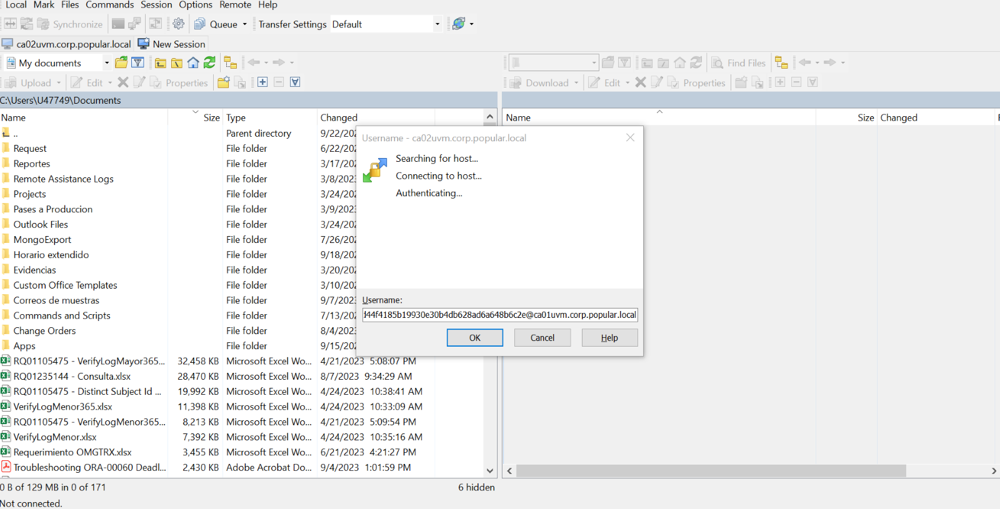

## Alejandro Jimenez Rosa

<table>
<thead>
<tr>
  <th>Inicio de  </th>
  <th> manual de MongoDB  AJ</th>
</tr>
</thead>
<tbody><tr>

<tr>
  <td></td>
  <td></td>
</tr>
<!-- <tr>
  <td>Siempre</td>
  <td></td>
</tr> -->

</tbody>
</table>

#

# Administracion de MongoDB.

# Administracion

# Servers MONGO PROD

~~~bash
PROD: azhvcdbgmas01.corp.popular.local
      azhvcdbgmas02.corp.popular.local
      azhvcdbgmas03.corp.popular.local
~~~
#

### MONGO ATLAS – CoreLibrary 
 - PROYECTO DONDE SE SUELE MIGRAR LAS DB ONPREMISE DE MONGODB
 #

 

<!--  -->

#

## SERVIDOR MONGO ONPREMISE PROD

 

<!--  -->
#

## SERVIDOR STAGIN MONGODB – NO SALE EN PAM Y DEBE ESTABLECER CONEXIÓN POR MOBAEXTERM O PUTTY

  AZDEHVSAPPATLA01
      User:
      _admin

    Pwd: 12345678As12345678As

  IP: 10.46.2.15
  AZDEHVSAPPATLA01

    User:
    _admin

    Pwd: 12345678As12345678As

  IP: 10.46.2.15

A screen shot of a computer

Description automatically generated

 

<!--  -->

~~~cmd
  Pass DB: #iHEgU9ynyKebI - root
  dbauserprod

  Popular001
~~~

1. Hacer backup de las bases de datos indicadas en el servidor de producción: Usar usuario root

#### Conectar al servidor de producción usando root.

 

<!--  -->

~~~bash
Pass DB: #iHEgU9ynyKebI - root
~~~

~~~bash
mongodump --ssl --authenticationDatabase admin 
--host=azhvcdbgmas01.corp.popular.local 
--port=27017 -u=root -p=#iHEgU9ynyKebI 
--sslPEMKeyFile=/etc/ssl/certs/server.pem 
--sslCAFile=/etc/ssl/certs/ca.pem --db=PersistentSessionStorageDB 
--archive=PersistentSessionStorageDB
~~~

#### Cambiar los permisos del backup en caso de ser necesario:

~~~bash
chmod 777 nombreBackup
~~~

2. Validar que accedemos al URI para mongo atlas.

~~~bash
mongosh mongodb+srv://msquarkus@corelibrary.fx2tn.mongodb.net --apiVersion 1
~~~

3. Mover backup generado en el servidor de producción a la maquina local y posteriormente moverlo al servidor stagin:

 

<!--  -->

#

#### Usamos WINSCP
 

<!--  -->

## CONEXIÓN AL SERVIDOR STAGIN USANDO WINSCP

 

<!--  -->

4. Restaurar la base de datos en mongoatlas a través del servidor stagin. Deben de compartir o validar la URI el equipo de Cloud. Usar usuario  DBAUSERPROD

~~~bash
User: dbauserprod
Pwd:  Popular001
~~~

~~~bash
mongorestore --uri=mongodb+srv://corelibrary.fx2tn.mongodb.net 
--username=dbauserprod --authenticationDatabase=admin 
--nsInclude="OnBoardingDB.*" --archive=OnBoardingDB
~~~

5. Conectar a la base de datos mongodb, para borrar colecciones en caso de ser necesario.

~~~bash
mongosh "mongodb+srv://corelibrary.fx2tn.mongodb.net" --apiVersion 1 --username dbauserprod
~~~

~~~bash
mongosh mongodb+srv://msquarkus@corelibrary.fx2tn.mongodb.net --apiVersion 1
~~~

~~~bash
use OnBoardingDB
db.customerDetails.drop()
~~~
